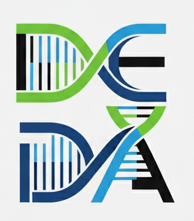

# Bio-informatics AI agent for Drug discovery Research

<p align="center">
  
</p>

Follow our [wiki pages](https://github.com/drug-discovery-ai/deda-drug-evaluation-and-discovery-agent/wiki) for more insight.

## Overview

DEDA - think of ChatGPT for bioinformatics researchers. 

It's designed as a lightweight, low-overhead tool that you can install in your laptop. 

DEDA focuses on integrating workflows, helping researchers explore drug discovery, analyze proteins, and quickly test new ideas - all through simple commands in English. 

For example, instead of writing code to pull protein data or run a molecule generator, you can ask:

```bash
Show known binding pockets for the SARS-CoV-2 virus.
```

The underlying Agentic AI does not do any guesswork. Instead it connects directly to real tools and data source, so answers are reliable and grounded.

<p align="center">
  
</p>


The AI connects to trusted sources like **UniProt**, **AlphaFold**, **OpenTargets** and others. This grounds its answers in real biological and chemical data, cutting down on hallucinations (more details [here](https://github.com/drug-discovery-ai/deda-drug-evaluation-and-discovery-agent/wiki/Bio%E2%80%90informatics-AI-agent-for-Drug-discovery-Research)). The result: bioinformatics workflows that are easier, more accurate, and repeatable—so researchers can focus on discovery instead of wrestling with tools.

**Disclaimer**: This tool helps portray and organize data, but it is not an inventor. Final insights and decisions **must** come from domain experts.

_Collaboration Call_: Contributions are needed to integrate advanced ML modeling components—such as Boltz-2—so the platform can generate and refine accurate protein data directly within our tool. For details, see our [contribution guideline](CONTRIBUTING.md).
## Quick Start

### Installation

Create a virtual environment using `python` version `3.12` or later.

```bash
python3 -m venv venv
```

Then activate the environment:

```bash
source venv/bin/activate
```

Then install the required packages:

```bash
pip install -r requirements.txt
```

```bash
pip install -e .
```

#### Setting Up Environment Variables

Before running any component, configure the required environment variables.
Copy the example environment file:

```bash
cp .env.example .env
```

Edit the `.env` file and add your OpenAI API key:

```
OPENAI_API_KEY=your_openai_api_key_here
```

---

## Running the Application

This project provides multiple ways to interact with the bioinformatics AI agent:

### 1. Running MCP Server

The Model Control Protocol (MCP) server provides the core AI agent functionality that can be integrated with compatible
clients like Claude Desktop.

Start the MCP server:

```bash
# Basic server
python -m drug_discovery_agent.interfaces.mcp.server

# With custom port
python -m drug_discovery_agent.interfaces.mcp.server --port 8081
```

The server will start on `localhost:8080` by default and can be connected to by MCP-compatible clients.

Start the MCP Client:
```bash
python -m drug_discovery_agent.interfaces.mcp.client
```

### 2. Running Chat on CLI

For quick terminal-based interactions with the AI agent:

```bash
python -m drug_discovery_agent.chat
# or simply
chat
```

#### Debug and Verbose Mode

To see detailed tool selection and execution activity (useful for debugging or understanding how the AI agent works):

```bash
python -m drug_discovery_agent.chat --verbose
# or
python -m drug_discovery_agent.chat --debug
```

This will show:

- Tool selection decisions made by the LLM
- Tool execution steps and reasoning
- Input/output details for each tool call
- Agent's internal reasoning process

Try queries like: `Show me details for UniProt ID P0DTC2`, followed
by `What are the structural properties of this protein?`

### 3. Running Chat on UI (Desktop App)

For a modern, user-friendly desktop experience, use the Electron-based chat interface:

**📱 [See the full Desktop App documentation →](electron-app/README.md)**

Quick setup:

```bash
cd electron-app
npm install
npm run dev
```

The desktop app provides:

- Modern chat interface with message history
- Real-time AI responses with progress indicators
- Session management and conversation persistence
- Cross-platform support (Windows, macOS, Linux)
- Integrated backend server management

#### Creating Distribution Installers

To create installable packages for distribution:

**📦 [See detailed installer creation guide →](electron-app/README.md#-creating-distribution-installers)**

Quick installer build:

```bash
# Navigate to electron-app directory
cd electron-app

# Build Python backend first
npm run build:python

# Then build Electron installer
npm run build:mac    # or build:win, build:linux
```

Supports creating native installers for Windows (.exe), macOS (.dmg), and Linux (.AppImage) with automatic environment
configuration and backend bundling.


### 4. Run the AI assistant using Docker

**Pre-requisite** Make sure your `docker` runs in `rootless` mode. If you can run

```
docker run hello-world
```

without `sudo`, you are good to go.

#### Change API Key Before Proceeding

Inside `entrypoint.sh`, replace the `OPENAI_API_KEY`, with your openAI api key.

```
ENV OPENAI_API_KEY=sk-proj-XXXX
```

Run the following command to build the docker image

```
docker build --no-cache -t deda .
```

To test

```
docker run -it -e RUN_CLIENT=true deda
```

Enjoy chatting!
